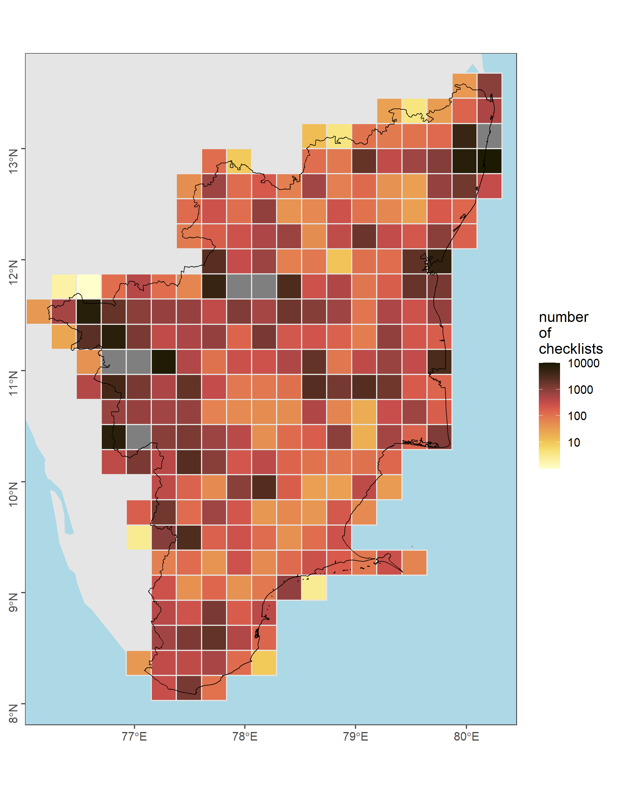

---
editor_options:
  chunk_output_type: console
---

# Spatial sampling   

In this script, we will examine data across multiple states with a focus on Kerala and Tamil Nadu separately. Since the Kerala Bird Atlas has been released, we suspect that the data is more structured when compared to the state of Tamil Nadu. we do not make an attempt to compare temporal sampling across scales in this script. For the state of Tamil Nadu and Kerala, we examine the proportion of checklists reported at 25 x 25 km grid level.  

## Prepare libraries
```{r setup_sup_02}
# load libraries
library(data.table)
library(readxl)
library(magrittr)
library(stringr)
library(dplyr)
library(tidyr)
library(readr)
library(ggplot2)
library(ggthemes)
library(scico)
library(extrafont)
library(sf)
library(rnaturalearth)

# round any function
round_25 <- function(x, accuracy = 25000) {
  round(x / accuracy) * accuracy
}

round_10 <- function(x, accuracy = 10000) {
  round(x / accuracy) * accuracy
}

round_5 <- function(x, accuracy = 5000) {
  round(x / accuracy) * accuracy
}


# set file paths for auk functions
# To use these two datasets, please download the latest versions from https://ebird.org/data/download and set the file path accordingly. Since these two datasets are extremely large, we have not uploaded the same to GitHub.
# In this study, the version of data loaded corresponds to July 2022.

f_in_ebd <- file.path("data/ebd_IN_relJul-2022.txt")
f_in_sampling <- file.path("data/ebd_sampling_relJul-2022.txt")
```


## Subset observations by geographical confines of the study area  

In this case, the geographical confines correspond to the states of Tamil Nadu and Kerala.  
```{r load_raw_data_supp02}
# read in shapefile of the study area to subset by bounding box

# first, we load the India states boundary from GADM
india_states <- st_read("data/spatial/shapefiles/IND_adm1.shp")

# load tamil nadu and kerala separately
tamil_nadu <- india_states[india_states$NAME_1=="Tamil Nadu",]
box_tn <- st_bbox(tamil_nadu)

kerala <- india_states[india_states$NAME_1=="Kerala",]
box_ker <- st_bbox(kerala)

# read in ebd data and subset by state for our analysis
# To access the latest dataset, please visit: https://ebird.org/data/download and set the file path accordingly.

ebd <- fread("data/ebd_IN_relJul-2022.txt")

# tamil nadu
tn_ebd <- ebd[between(LONGITUDE, box_tn["xmin"], box_tn["xmax"]) &
  between(LATITUDE, box_tn["ymin"], box_tn["ymax"]), ]
# make new column names
newNames <- str_replace_all(colnames(tn_ebd), " ", "_") %>%
  str_to_lower()
setnames(tn_ebd, newNames)
# keep useful columns
columnsOfInterest <- c(
  "common_name", "scientific_name", "observation_count", "locality",
  "locality_id", "locality_type", "latitude",
  "longitude", "observation_date", "sampling_event_identifier"
)
tn_ebd <- tn_ebd[, ..columnsOfInterest]

# kerala
ker_ebd <- ebd[between(LONGITUDE, box_ker["xmin"], box_ker["xmax"]) &
  between(LATITUDE, box_ker["ymin"], box_ker["ymax"]), ]
# make new column names
newNames <- str_replace_all(colnames(ker_ebd), " ", "_") %>%
  str_to_lower()
setnames(ker_ebd, newNames)
# keep useful columns
columnsOfInterest <- c(
  "common_name", "scientific_name", "observation_count", "locality",
  "locality_id", "locality_type", "latitude",
  "longitude", "observation_date", "sampling_event_identifier"
)
ker_ebd <- ker_ebd[, ..columnsOfInterest]

# remove the large ebd file if it's not required
rm(ebd)
gc() # run this function to clear up some memory space
```

## Data cleaning prior to visualization

```{r}
# Convert all presences marked 'X' as '1'
tn_ebd <- tn_ebd %>%
  mutate(observation_count = ifelse(observation_count == "X",
    "1", observation_count
  ))

ker_ebd <- ker_ebd %>%
  mutate(observation_count = ifelse(observation_count == "X",
    "1", observation_count
  ))

# Convert observation count to numeric
tn_ebd$observation_count <- as.numeric(tn_ebd$observation_count)
ker_ebd$observation_count <- as.numeric(ker_ebd$observation_count)
```

## Load spatial grids for checklist locations

Add a spatial filter.  
```{r strict_filter_supp02}
# strict spatial filter and assign grid
tn_locs <- tn_ebd[, .(longitude, latitude)]
ker_locs <- ker_ebd[, .(longitude, latitude)]

# transform to UTM 
tn_coords <- setDF(tn_locs) %>%
  st_as_sf(coords = c("longitude", "latitude")) %>%
  `st_crs<-`(4326) %>%
  bind_cols(as.data.table(st_coordinates(.))) %>%
  st_transform(32643) %>%
  mutate(id = 1:nrow(.))

ker_coords <- setDF(ker_locs) %>%
  st_as_sf(coords = c("longitude", "latitude")) %>%
  `st_crs<-`(4326) %>%
  bind_cols(as.data.table(st_coordinates(.))) %>%
  st_transform(32643) %>%
  mutate(id = 1:nrow(.))

# convert to UTM for filter
tamil_nadu <- st_transform(tamil_nadu, 32643)
kerala <- st_transform(kerala, 32643)

tn_coords <- tn_coords %>%
  filter(id %in% unlist(st_contains(tamil_nadu, tn_coords))) %>%
  rename(longitude = X, latitude = Y) %>%
  bind_cols(as.data.table(st_coordinates(.))) %>%
  st_drop_geometry() %>%
  as.data.table()

ker_coords <- ker_coords %>%
  filter(id %in% unlist(st_contains(kerala, ker_coords))) %>%
  rename(longitude = X, latitude = Y) %>%
  bind_cols(as.data.table(st_coordinates(.))) %>%
  st_drop_geometry() %>%
  as.data.table()

# remove unneeded objects
rm(tn_locs, ker_locs)
gc()

tn_coords <- tn_coords[, .N, by = .(longitude, latitude, X, Y)]
ker_coords <- ker_coords[, .N, by = .(longitude, latitude, X, Y)]

tn_ebd <- merge(tn_ebd, tn_coords, all = FALSE, by = c("longitude", "latitude"))
tn_ebd <- tn_ebd[(longitude %in% tn_coords$longitude) &
  (latitude %in% tn_coords$latitude), ]

ker_ebd <- merge(ker_ebd, ker_coords, all = FALSE, by = c("longitude", "latitude"))
ker_ebd <- ker_ebd[(longitude %in% ker_coords$longitude) &
  (latitude %in% ker_coords$latitude), ]
```

## Get proportional observation counts across every 25 km x 25 km grid

Analysis of proportional counts estimated at 25km
```{r count_obs_cell}

## Analysis of proportional counts at 25 km for each state

# round to 25km cell in UTM coords
tn_ebd[, `:=`(X = round_25(X), Y = round_25(Y))]
ker_ebd[, `:=`(X = round_25(X), Y = round_25(Y))]

# count checklists in cell
tn_ebd_summary <- tn_ebd[, nchk := length(unique(sampling_event_identifier)),
  by = .(X, Y)]
ker_ebd_summary <- ker_ebd[, nchk := length(unique(sampling_event_identifier)),
  by = .(X, Y)]

# count checklists reporting each species in cell and get proportion
tn_ebd_summary <- tn_ebd_summary[, .(nrep = length(unique(
  sampling_event_identifier
))),
by = .(X, Y, nchk, scientific_name)
]
tn_ebd_summary[, p_rep := nrep / nchk]

ker_ebd_summary <- ker_ebd_summary[, .(nrep = length(unique(
  sampling_event_identifier
))),
by = .(X, Y, nchk, scientific_name)
]
ker_ebd_summary[, p_rep := nrep / nchk]

# complete the dataframe for no reports
# keep no reports as NA --- allows filtering based on proportion reporting
tn_ebd_summary <- setDF(tn_ebd_summary) %>%
  complete(
    nesting(X, Y), scientific_name # ,
    # fill = list(p_rep = 0)
  ) %>%
  filter(!is.na(p_rep))

ker_ebd_summary <- setDF(ker_ebd_summary) %>%
  complete(
    nesting(X, Y), scientific_name # ,
    # fill = list(p_rep = 0)
  ) %>%
  filter(!is.na(p_rep))

# remove species that are poorly reported (only filter being applied at this stage)
# for example, accounts such as 'Turdidae sp.', are removed and only the latest
# list of scientific names are taken into consideration

trait_dat <- read.csv("data/2022-SoIB-habitat-data.csv")
speciesOfInterest <- data.frame(trait_dat$eBird.Scientific.Name.2021)
names(speciesOfInterest) <- "scientific_name"

# filter for species list above (not running this as we are currently not applying filters)
tn_ebd_summary <- tn_ebd_summary[tn_ebd_summary$scientific_name %in% speciesOfInterest$scientific_name, ]
ker_ebd_summary <- ker_ebd_summary[ker_ebd_summary$scientific_name %in% speciesOfInterest$scientific_name, ]
```

## Checklist distribution 

```{r }
# total number of checklists across unique grids
tn_tot_n_chklist <- tn_ebd_summary %>%
  distinct(X, Y, nchk)
ker_tot_n_chklist <- ker_ebd_summary %>%
  distinct(X, Y, nchk)

# Tamil Nadu has a total of 257 unique grids (25 km x 25 km)
# Kerala has a total of 96 unique grids (25 km x 25 km)

# species-specific number of grids
tn_spp_grids <- tn_ebd_summary %>%
  group_by(scientific_name) %>%
  distinct(X, Y) %>%
  count(scientific_name,
    name = "n_grids"
  )
ker_spp_grids <- ker_ebd_summary %>%
  group_by(scientific_name) %>%
  distinct(X, Y) %>%
  count(scientific_name,
    name = "n_grids"
  )

# Write the above two results
write.csv(tn_spp_grids, "results/01_ngrids-per-spp-TamilNadu.csv", row.names=F)
write.csv(ker_spp_grids, "results/01_ngrids-per-spp-Kerala.csv", row.names=F)

# left-join the datasets
tn_ebd_summary <- left_join(tn_ebd_summary, tn_spp_grids, by = "scientific_name")
ker_ebd_summary <- left_join(ker_ebd_summary, ker_spp_grids, by = "scientific_name")
```

## Figure: Checklist distribution

```{r load_map_plot_data}
# add land
land <- ne_countries(
  scale = 50, type = "countries", continent = "asia",
  country = "india",
  returnclass = c("sf")
)
# crop land
land <- st_transform(land, 32643)
```

```{r, echo=FALSE}
# make plot
tamil_nadu <- st_transform(tamil_nadu, 32643)
tn_bbox <- st_bbox(tamil_nadu)

kerala <- st_transform(kerala, 32643)
ker_bbox <- st_bbox(kerala)

# get a plot of number of checklists across grids for Tamil Nadu
tn_plotNchk <-
  ggplot() +
  geom_sf(data = land, fill = "grey90", col = NA) +
  geom_tile(
    data = tn_tot_n_chklist,
    aes(X, Y, fill = nchk), lwd = 0.5, col = "grey90"
  ) +
  geom_sf(data = tamil_nadu, fill = NA, col = "black", lwd = 0.3) +
  scale_fill_scico(
    palette = "lajolla",
    direction = 1,
    trans = "log10",
    limits = c(1, 10000),
    breaks = 10^c(1:4)
  ) +
  coord_sf(xlim = tn_bbox[c("xmin", "xmax")], ylim = tn_bbox[c("ymin", "ymax")]) +
  theme_few() +
  theme(
    legend.position = "right",
    axis.title = element_blank(),
    axis.text.y = element_text(angle = 90),
    panel.background = element_rect(fill = "lightblue")
  ) +
  labs(fill = "number\nof\nchecklists")

# export data
ggsave(tn_plotNchk,
  filename = "figs/fig_number_checklists_25km_TamilNadu.png", height = 9,
  width = 7, device = png(), dpi = 300
)
dev.off()

# get a plot of number of checklists across grids for Tamil Nadu
ker_plotNchk <-
  ggplot() +
  geom_sf(data = land, fill = "grey90", col = NA) +
  geom_tile(
    data = ker_tot_n_chklist,
    aes(X, Y, fill = nchk), lwd = 0.5, col = "grey90"
  ) +
  geom_sf(data = kerala, fill = NA, col = "black", lwd = 0.3) +
  scale_fill_scico(
    palette = "lajolla",
    direction = 1,
    trans = "log10",
    limits = c(1, 10000),
    breaks = 10^c(1:4)
  ) +
  coord_sf(xlim = ker_bbox[c("xmin", "xmax")], ylim = ker_bbox[c("ymin", "ymax")]) +
  theme_few() +
  theme(
    legend.position = "right",
    axis.title = element_blank(),
    axis.text.y = element_text(angle = 90),
    panel.background = element_rect(fill = "lightblue")
  ) +
  labs(fill = "number\nof\nchecklists")

# export data
ggsave(ker_plotNchk,
  filename = "figs/fig_number_checklists_25km_Kerala.png", height = 9,
  width = 7, device = png(), dpi = 300
)
dev.off()
```



## What species are reported sufficiently in checklists?

Here, we estimate the proportion of species that are reported in atleast 50% of checklists across each grid (grid size: 25 km x 25 km) 

```{r}
p_cutoff <- 0.05 # Proportion of checklists a species has been reported in

tn_grid_proportions <- tn_ebd_summary %>%
  group_by(scientific_name) %>%
  tally(p_rep >= p_cutoff) %>%
  mutate(prop_grids_cut = n / (tn_spp_grids$n_grids)) %>%
  arrange(desc(prop_grids_cut))
tn_grid_prop_cut <- filter(
  tn_grid_proportions,
  prop_grids_cut >= p_cutoff
)

ker_grid_proportions <- ker_ebd_summary %>%
  group_by(scientific_name) %>%
  tally(p_rep >= p_cutoff) %>%
  mutate(prop_grids_cut = n / (ker_spp_grids$n_grids)) %>%
  arrange(desc(prop_grids_cut))
ker_grid_prop_cut <- filter(
  ker_grid_proportions,
  prop_grids_cut >= p_cutoff
)

# Write the results
write.csv(tn_grid_prop_cut, "results/01_prop-grids-per-spp-TamilNadu.csv", row.names = F)
write.csv(ker_grid_prop_cut, "results/01_prop-grids-per-spp-Kerala.csv", row.names = F)

# Identifying the number of species that occur in potentially <5% of all lists
tn_total_number_lists <- sum(tn_tot_n_chklist$nchk)
ker_total_number_lists <- sum(ker_tot_n_chklist$nchk)

tn_spp_sum_chk <- tn_ebd_summary %>%
  distinct(X, Y, scientific_name, nrep) %>%
  group_by(scientific_name) %>%
  mutate(sum_chk = sum(nrep)) %>%
  distinct(scientific_name, sum_chk)

ker_spp_sum_chk <- ker_ebd_summary %>%
  distinct(X, Y, scientific_name, nrep) %>%
  group_by(scientific_name) %>%
  mutate(sum_chk = sum(nrep)) %>%
  distinct(scientific_name, sum_chk)

# 58 species of the list of 527 occur in >5% of all checklists for Tamil Nadu
tn_prop_all_lists <- tn_spp_sum_chk %>%
  mutate(prop_lists = sum_chk / tn_total_number_lists) %>%
  arrange(desc(prop_lists))

# 66 species of the list of 526 occur in 5% of all checklists for Kerala
ker_prop_all_lists <- ker_spp_sum_chk %>%
  mutate(prop_lists = sum_chk / ker_total_number_lists) %>%
  arrange(desc(prop_lists))
```

## Figure: Proportion of checklists reporting species in each grid cell

Note: Here we plot all species that occur in atleast 5% of all checklists across half of the 25 x 25 km cells from where they have been reported 
```{r plot_obs_distributions,echo=FALSE}
# filter list of species
tn_ebd_filter <- semi_join(tn_ebd_summary, tn_grid_prop_cut, by = "scientific_name")
ker_ebd_filter <- semi_join(ker_ebd_summary, ker_grid_prop_cut, by = "scientific_name")

# run the loop to create a list of plots
tn_plots <- list()

for(i in 1:length(unique(tn_ebd_filter$scientific_name))) {
  
  a <- unique(tn_ebd_filter$scientific_name)[i]
  data <- tn_ebd_filter[tn_ebd_filter$scientific_name==a,]
  
  tn_plots[[i]] <-
  ggplot() +
  geom_sf(data = land, fill = "grey90", col = NA) +
  geom_tile(
    data = data,
    aes(X, Y, fill = p_rep), lwd = 0.5, col = "grey90"
  ) +
  geom_sf(data = tamil_nadu, fill = NA, col = "black", lwd = 0.3) +
  scale_fill_scico(palette = "lajolla", direction = 1, label = scales::percent) +
  facet_wrap(~scientific_name, ncol = 12) +
  coord_sf(xlim = tn_bbox[c("xmin", "xmax")], ylim = tn_bbox[c("ymin", "ymax")]) +
  ggthemes::theme_few(
    base_family = "Century Gothic",
    base_size = 8
  ) +
  theme(
    legend.position = "right",
    strip.text = element_text(face = "italic"),
    axis.title = element_blank(),
    axis.text.y = element_text(angle = 90),
    panel.background = element_rect(fill = "lightblue")
  ) +
  labs(fill = "prop.\nreporting\nchecklists")

}

# plot and save as a single pdf
cairo_pdf(
  filename = "figs/species-proportions-TamilNadu.pdf",
  onefile = TRUE
)
tn_plots
dev.off()

# Kerala
ker_plots <- list()

for(i in 1:length(unique(ker_ebd_filter$scientific_name))) {
  
  a <- unique(ker_ebd_filter$scientific_name)[i]
  data <- ker_ebd_filter[ker_ebd_filter$scientific_name==a,]
  
  ker_plots[[i]] <-
  ggplot() +
  geom_sf(data = land, fill = "grey90", col = NA) +
  geom_tile(
    data = data,
    aes(X, Y, fill = p_rep), lwd = 0.5, col = "grey90"
  ) +
  geom_sf(data = kerala, fill = NA, col = "black", lwd = 0.3) +
  scale_fill_scico(palette = "lajolla", direction = 1, label = scales::percent) +
  facet_wrap(~scientific_name, ncol = 12) +
  coord_sf(xlim = ker_bbox[c("xmin", "xmax")], ylim = ker_bbox[c("ymin", "ymax")]) +
  ggthemes::theme_few(
    base_family = "Century Gothic",
    base_size = 8
  ) +
  theme(
    legend.position = "right",
    strip.text = element_text(face = "italic"),
    axis.title = element_blank(),
    axis.text.y = element_text(angle = 90),
    panel.background = element_rect(fill = "lightblue")
  ) +
  labs(fill = "prop.\nreporting\nchecklists")

}

# plot and save as a single pdf
cairo_pdf(
  filename = "figs/species-proportions-Kerala.pdf",
  onefile = TRUE
)
ker_plots
dev.off()
```

## write the species lists to file

```{r}
# write the list of species that occur in at least 5% of checklists across a minimum of 50% of the grids they have been reported in
tn_sp_list <- semi_join(speciesOfInterest, tn_grid_prop_cut, by = "scientific_name")
ker_sp_list <- semi_join(speciesOfInterest, ker_grid_prop_cut, by = "scientific_name")
 
write.csv(tn_sp_list, "results/01_list-of-species-cutoff50-TamilNadu.csv", row.names = F)
write.csv(ker_sp_list, "results/01_list-of-species-cutoff50-Kerala.csv", row.names = F)
```
