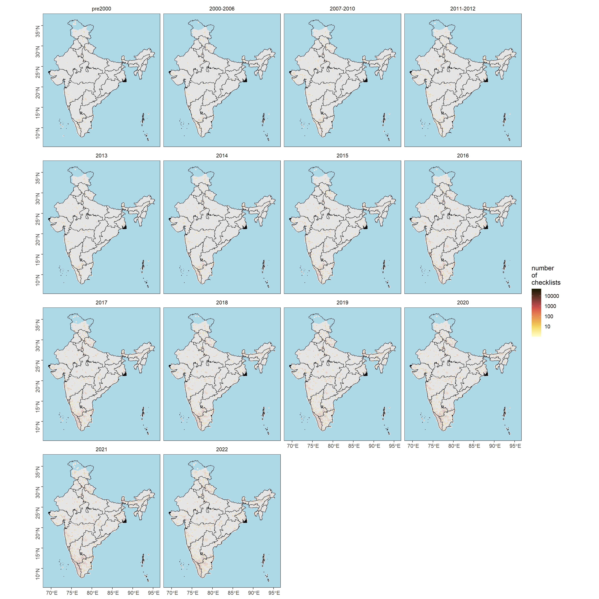
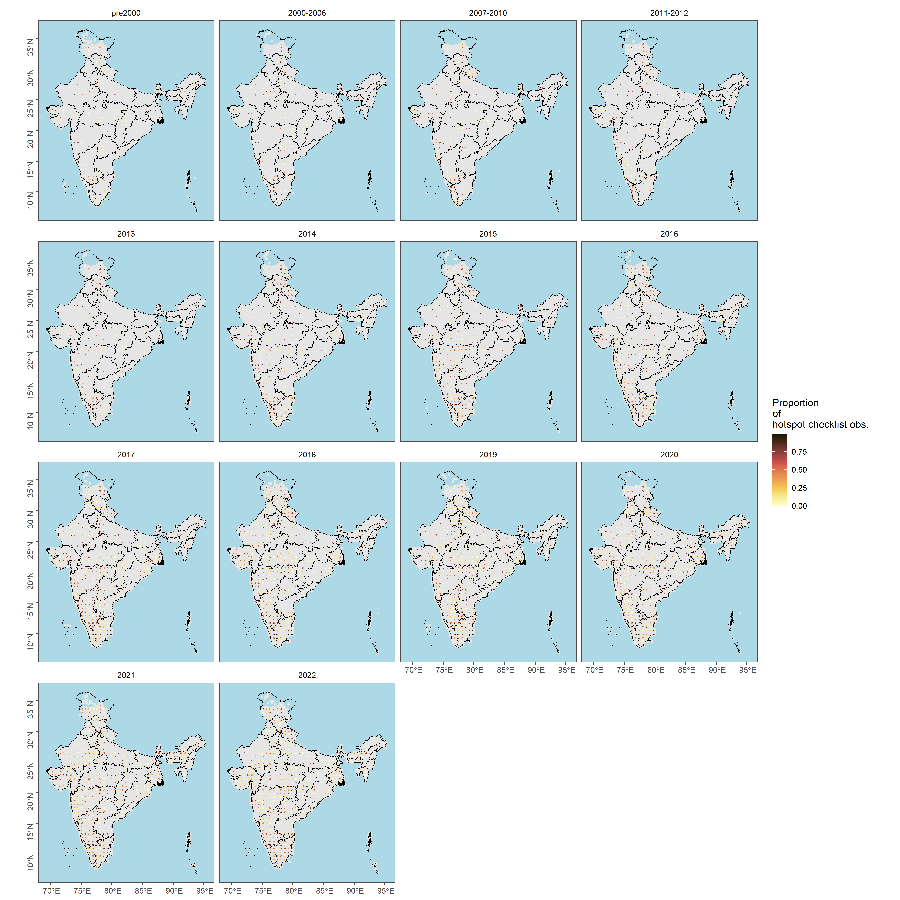

---
editor_options:
  chunk_output_type: console
---

# Locality type 

In this script, we will visualize checklist observations spatially and temporally to assess if there are differences in reporting of observations depending on locality type - i.e. hotspot or personal observations.

## Prepare libraries
```{r}
library(data.table)
library(readxl)
library(magrittr)
library(stringr)
library(dplyr)
library(tidyr)
library(readr)
library(ggplot2)
library(ggthemes)
library(scico)
library(extrafont)
library(sf)
library(rnaturalearth)
library(lme4)
library(multcomp)
library(sjPlot)
library(ggstatsplot)
library(paletteer)
```

## Load .Rdata from a previous script
```{r}
load("data/02_ebd-India-spatial-temporal.RData")
```

## Subset data by hotspot or personal locations
```{r}
# personal locations
ebd_persLoc <- ebd_in %>%
  filter(locality_type == "P") # ~ 15 million observations 

# hotspot locations
ebd_hotLoc <- ebd_in %>%
  filter(locality_type == "H") # ~ 19 million observations

## count checklists in cell
ebd_summary_pers <- ebd_persLoc[, nchk := length(unique(sampling_event_identifier)),
  by = .(X, Y, timePeriod)]
ebd_summary_hot <- ebd_hotLoc[, nchk := length(unique(sampling_event_identifier)),
  by = .(X, Y, timePeriod)]

# count checklists reporting each species in cell and get proportion
ebd_summary_pers <- ebd_summary_pers[, .(nrep = length(unique(
  sampling_event_identifier
))),
by = .(X, Y, nchk, scientific_name, timePeriod)
]
ebd_summary_pers[, p_rep := nrep / nchk]

ebd_summary_hot <- ebd_summary_hot[, .(nrep = length(unique(
  sampling_event_identifier
))),
by = .(X, Y, nchk, scientific_name, timePeriod)
]
ebd_summary_hot[, p_rep := nrep / nchk]

# complete the dataframe for no reports
# keep no reports as NA --- allows filtering based on proportion reporting
ebd_summary_pers <- setDF(ebd_summary_pers) %>%
  complete(
    nesting(X, Y), scientific_name, timePeriod # ,
    # fill = list(p_rep = 0)
  ) %>%
  filter(!is.na(p_rep))

ebd_summary_hot <- setDF(ebd_summary_hot) %>%
  complete(
    nesting(X, Y), scientific_name, timePeriod # ,
    # fill = list(p_rep = 0)
  ) %>%
  filter(!is.na(p_rep))

# filter for species list above
ebd_summary_pers <- ebd_summary_pers[ebd_summary_pers$scientific_name %in% speciesOfInterest$scientific_name, ]
ebd_summary_hot <- ebd_summary_hot[ebd_summary_hot$scientific_name %in% speciesOfInterest$scientific_name, ]
```

## Checklist distribution over time across personal and hotspot locations
```{r }
# total number of checklists
tot_n_chklist_pers <- ebd_summary_pers %>%
  distinct(X, Y, nchk, timePeriod)
tot_n_chklist_hot <- ebd_summary_hot %>%
  distinct(X, Y, nchk, timePeriod)

# species-specific number of grids by time Period
spp_grids_pers <- ebd_summary_pers %>%
  group_by(scientific_name, timePeriod) %>%
  distinct(X, Y) %>%
  count(scientific_name,
    name = "n_grids"
  )
spp_grids_hot <- ebd_summary_hot %>%
  group_by(scientific_name, timePeriod) %>%
  distinct(X, Y) %>%
  count(scientific_name,
    name = "n_grids"
  )

# Write the above two results
write.csv(spp_grids_pers, "results/03_ngrids-per-spp-by-timePeriod-personalLoc.csv", row.names=F)
write.csv(spp_grids_hot, "results/03_ngrids-per-spp-by-timePeriod-hotLoc.csv", row.names=F)
```

## Figure: Checklist distribution by time period
```{r}
# reordering factors for plotting
tot_n_chklist_pers$timePeriod <- factor(tot_n_chklist_pers$timePeriod, levels = c("pre2000", "2000-2006", "2007-2010","2011-2012","2013","2014","2015",
  "2016","2017","2018","2019","2020","2021","2022"))
tot_n_chklist_hot$timePeriod <- factor(tot_n_chklist_hot$timePeriod, levels = c("pre2000", "2000-2006", "2007-2010","2011-2012","2013","2014","2015",
  "2016","2017","2018","2019","2020","2021","2022"))

# get a plot of number of checklists across grids for each timePeriod
plotNchk_pers <-
  ggplot() +
  geom_sf(data = land, fill = "grey90", col = NA) +
  geom_tile(
    data = tot_n_chklist_pers,
    aes(X, Y, fill = nchk), lwd = 0.5, col = "grey90"
  ) +
  geom_sf(data = india_states, fill = NA, col = "black", lwd = 0.3) +
  scale_fill_scico(
    palette = "lajolla",
    direction = 1,
    trans = "log10",
    limits = c(1, 50000),
    breaks = 10^c(1:5)
  ) +
  facet_wrap(~timePeriod) +
  coord_sf(xlim = bbox[c("xmin", "xmax")], ylim = bbox[c("ymin", "ymax")]) +
  theme_few() +
  theme(
    legend.position = "right",
    axis.title = element_blank(),
    axis.text.y = element_text(angle = 90),
    panel.background = element_rect(fill = "lightblue")
  ) +
  labs(fill = "number\nof\nchecklists")

# export data
ggsave(plotNchk_pers,
  filename = "figs/fig_number_checklists_25km_by_timePeriod_persLoc.png", height = 15,  width = 15, device = png(), dpi = 300
)
dev.off()

plotNchk_hot <-
  ggplot() +
  geom_sf(data = land, fill = "grey90", col = NA) +
  geom_tile(
    data = tot_n_chklist_hot,
    aes(X, Y, fill = nchk), lwd = 0.5, col = "grey90"
  ) +
  geom_sf(data = india_states, fill = NA, col = "black", lwd = 0.3) +
  scale_fill_scico(
    palette = "lajolla",
    direction = 1,
    trans = "log10",
    limits = c(1, 50000),
    breaks = 10^c(1:5)
  ) +
  facet_wrap(~timePeriod) +
  coord_sf(xlim = bbox[c("xmin", "xmax")], ylim = bbox[c("ymin", "ymax")]) +
  theme_few() +
  theme(
    legend.position = "right",
    axis.title = element_blank(),
    axis.text.y = element_text(angle = 90),
    panel.background = element_rect(fill = "lightblue")
  ) +
  labs(fill = "number\nof\nchecklists")

# export data
ggsave(plotNchk_hot,
  filename = "figs/fig_number_checklists_25km_by_timePeriod_hotLoc.png", height = 15,  width = 15, device = png(), dpi = 300
)
dev.off()
```




## Testing for differences in number of checklists by time period and location type
```{r}
# Test if there are significant differences in the number of checklists by time period

# add a grid code (to be used in a random effects model)
tot_n_chklist_pers <- tot_n_chklist_pers %>%
  group_by(X,Y) %>%
  mutate(gridCode = cur_group_id()) %>%
  ungroup()
tot_n_chklist_hot <- tot_n_chklist_hot %>%
  group_by(X,Y) %>%
  mutate(gridCode = cur_group_id()) %>%
  ungroup()

# Note: this takes a long-time to run
glmm_nChk_time_pers <- glmer(nchk ~ timePeriod + (1|gridCode), data = tot_n_chklist_pers, family = poisson(link="log"))
glmm_nChk_time_hot <- glmer(nchk ~ timePeriod + (1|gridCode), data = tot_n_chklist_hot, family = poisson(link="log"))

tukey_nChk_time_pers <- summary(glht(glmm_nChk_time_pers, linfct=mcp(timePeriod ="Tukey")))
cld(tukey_nChk_time_pers)

# pre2000 2000-2006 2007-2010 2011-2012      2013      2014      2015 
#      "d"       "c"       "d"       "b"       "a"       "e"       "f" 
#     2016      2017      2018      2019      2020      2021      2022 
#      "g"       "h"       "i"       "j"       "m"       "l"       "k" 

tukey_nChk_time_hot <- summary(glht(glmm_nChk_time_hot, linfct=mcp(timePeriod ="Tukey")))
cld(tukey_nChk_time_hot)

# pre2000 2000-2006 2007-2010 2011-2012      2013      2014      2015 
#      "b"       "a"       "d"       "c"       "a"       "e"       "f" 
#     2016      2017      2018      2019      2020      2021      2022 
#      "g"       "h"       "i"       "k"       "l"       "m"       "j" 
```

## Figure: violinplot of number of checklists
```{r}
# create log values of nChk
tot_n_chklist_pers$logNchk <- log(tot_n_chklist_pers$nchk)
tot_n_chklist_hot$logNchk <- log(tot_n_chklist_hot$nchk)

fig_nchk_time_pers <- ggbetweenstats(
  data = tot_n_chklist_pers,
  x = timePeriod,
  y = logNchk,
  xlab = "Time Period", 
  ylab = "log Number of checklists",
  title = "Distribution of checklists by time period across personal locations",
  plot.type = "boxviolin",
  pairwise.comparisons = F)+ ## Note: this is done to avoid plot cluttering
  scale_color_manual(values = c("#7E1900", "#944611", "#A66B20", "#B89130", "#CBB94A", "#E0DC7B","#180B09" ,"#2C0E00", "#461300", "#68240F", "#8E422E", "#B36556","#D88881", "#4799C9")) +
  theme(plot.title = element_text(family = "Century Gothic",
      size = 18, face = "bold"),
    axis.title = element_text(family = "Century Gothic",
      size = 16, face = "bold"),
        axis.text = element_text(family="Century Gothic",size = 14),
      plot.subtitle = element_text(
      family = "Century Gothic", 
      size = 14, 
      face = "bold",
      color="#1b2838"
    ))

fig_nchk_time_hot <- ggbetweenstats(
  data = tot_n_chklist_hot,
  x = timePeriod,
  y = logNchk,
  xlab = "Time Period", 
  ylab = "log Number of checklists",
  title = "Distribution of checklists by time period across hotspot locations",
  plot.type = "boxviolin",
  pairwise.comparisons = F)+ ## Note: this is done to avoid plot cluttering
  scale_color_manual(values = c("#7E1900", "#944611", "#A66B20", "#B89130", "#CBB94A", "#E0DC7B","#180B09" ,"#2C0E00", "#461300", "#68240F", "#8E422E", "#B36556","#D88881", "#4799C9")) +
  theme(plot.title = element_text(family = "Century Gothic",
      size = 18, face = "bold"),
    axis.title = element_text(family = "Century Gothic",
      size = 16, face = "bold"),
        axis.text = element_text(family="Century Gothic",size = 14),
      plot.subtitle = element_text(
      family = "Century Gothic", 
      size = 14, 
      face = "bold",
      color="#1b2838"
    ))

ggsave(fig_nchk_time_pers, filename = "figs/fig_logChecklists_timePeriod_persLoc.png", width = 15, height = 10, device = png(), units = "in", dpi = 300)
dev.off()
ggsave(fig_nchk_time_hot, filename = "figs/fig_logChecklists_timePeriod_hotLoc.png", width = 15, height = 10, device = png(), units = "in", dpi = 300)
dev.off()

## Note: pairwise comparisons where there is a significant difference in the log Number of checklists across the time periods compared (using a Games-Howell test)
## Please view the statistics below for more details

stats_persLoc_logNChk <- pairwise_comparisons(tot_n_chklist_pers, timePeriod, logNchk) %>%
  filter(p.value <= 0.05) %>%
  data.frame()
write.csv(stats_persLoc_logNChk[,-9], "results/03_pairwiseComparisons_persLoc_logNchk.csv", row.names = F)

stats_hotLoc_logNChk <- pairwise_comparisons(tot_n_chklist_hot, timePeriod, logNchk) %>%
  filter(p.value <= 0.05) %>%
  data.frame()
write.csv(stats_hotLoc_logNChk[,-9], "results/03_pairwiseComparisons_hotLoc_logNchk.csv", row.names = F)
```


## What is the number of checklists from each grid that are reported from hotspots compared to personal observations?

```{r}
pers_hot <-  left_join(tot_n_chklist_pers[,-c(5,6)], tot_n_chklist_hot[,-c(5,6)],by = c("X","Y", "timePeriod")) %>%
  replace(is.na(.), 0)
names(pers_hot)[4] <- "P"
names(pers_hot)[5] <- "H"

pers_hot <- pers_hot %>%
  mutate(prop_pers = ((P)/(P+H))) %>%
  mutate(prop_hot = ((H)/(P+H)))
```

## Visualization of hotspot and personal observations from the same grid across time
```{r}
# reordering factors for plotting
pers_hot$timePeriod <- factor(pers_hot$timePeriod, levels = c("pre2000", "2000-2006", "2007-2010","2011-2012","2013","2014","2015",
  "2016","2017","2018","2019","2020","2021","2022"))

# get a plot of proportion of checklists across grids for each timePeriod for personal observations
plot_prop_pers <-
  ggplot() +
  geom_sf(data = land, fill = "grey90", col = NA) +
  geom_tile(
    data = pers_hot,
    aes(X, Y, fill = prop_pers), lwd = 0.5, col = "grey90") +
  geom_sf(data = india_states, fill = NA, col = "black", lwd = 0.3) +
  scale_fill_scico(
    palette = "lajolla",
    direction = 1
  ) +
  facet_wrap(~timePeriod) +
  coord_sf(xlim = bbox[c("xmin", "xmax")], ylim = bbox[c("ymin", "ymax")]) +
  theme_few() +
  theme(
    legend.position = "right",
    axis.title = element_blank(),
    axis.text.y = element_text(angle = 90),
    panel.background = element_rect(fill = "lightblue")
  ) +
  labs(fill = "Proportion\nof\npersonal checklist obs.")

# export data
ggsave(plot_prop_pers,
  filename = "figs/fig_prop_checklists_persLoc.png", height = 15,  width = 15, device = png(), dpi = 300
)
dev.off()

# get a plot of proportion of checklists across grids for each timePeriod for hotspot observations
plot_prop_hot <-
  ggplot() +
  geom_sf(data = land, fill = "grey90", col = NA) +
  geom_tile(
    data = pers_hot,
    aes(X, Y, fill = prop_hot), lwd = 0.5, col = "grey90") +
  geom_sf(data = india_states, fill = NA, col = "black", lwd = 0.3) +
  scale_fill_scico(
    palette = "lajolla",
    direction = 1
  ) +
  facet_wrap(~timePeriod) +
  coord_sf(xlim = bbox[c("xmin", "xmax")], ylim = bbox[c("ymin", "ymax")]) +
  theme_few() +
  theme(
    legend.position = "right",
    axis.title = element_blank(),
    axis.text.y = element_text(angle = 90),
    panel.background = element_rect(fill = "lightblue")
  ) +
  labs(fill = "Proportion\nof\nhotspot checklist obs.")

# export data
ggsave(plot_prop_hot,
  filename = "figs/fig_prop_checklists_hotLoc.png", height = 15,  width = 15, device = png(), dpi = 300
)
dev.off()
```


