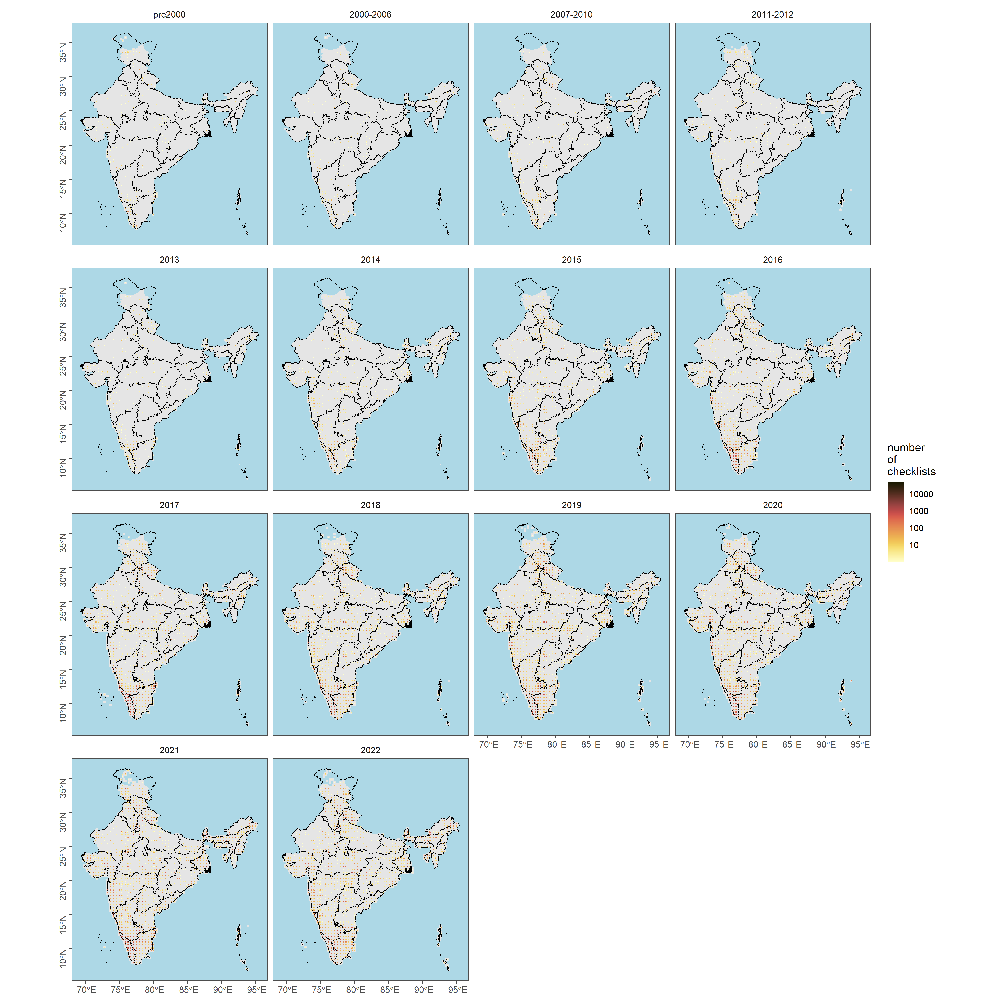

## Source code for *Examining spatial and temporal biases in a citizen science dataset*

This repository serves as an accompaniment to the State of India's Birds report (v2; expected March 2023) and aims to critically examine spatial and temporal biases associated with eBird data.

### [Readable version](https://vjjan91.github.io/eBird-India/)

A readable version of this analysis (along with code) is available in bookdown format by clicking on the heading above. If you would like to examine only the key results without accompanying code, please scroll further down.

### Source code for the analyses

We describe what each script (`.Rmd`) of this repository is intended to achieve below.

The overall analysis is divided into two halves (consisting of numerous scripts, each) - the first half deals with no filters (a filter is essentially a criterion used to subset data. For example, if I wanted to view observations that included a minimum effort of 1 hour) and uses *only* the raw dataset of observations.

The second half deals with the application of multiple filters/criteria and analyzes a subset of bird observations.

-   *01_spatial-visualization-allChk.Rmd:*. Here, visualize the overall number of checklists across the Indian subcontinent and repeat the same analysis at the species level. At this stage, no specific filters are applied and we report all analysis for every 25 x 25 km grid size (finer scales/sizes will be used for comparison at a later stage).

-   *02_temporal-visualization-allChk.Rmd:*. Here, we visualize all checklist observations temporally to assess if there are biases in reporting over time. For example, are more observations being reported in a particular 5-year interval/time-period when compared to another time period. We also aim to assess if there are significant differences in the number of observations across time periods.

-   *03_locality-type.Rmd:*. Here, we visualize checklist observations spatially and temporally to assess if there are differences in reporting of observations depending on locality type - i.e. hotspot or personal observations.

-   *04_protocol-type.Rmd:*. Here, we visualize checklist observations spatially and temporally to assess if there are differences in reporting of observations depending on protocol type - i.e. incidental, stationary, or traveling checklists. For the purpose of this exercise, only stationary and traveling checklists are chosen, as these two protocol types often contribute to complete checklists (incidental checklists are often ignored in most analyses as they only offer a snapshot of bird presence/absence at a location).

-   *05_land-cover-analysis.Rmd:*. **work-in-progress, come-back-later**

### Results

Here, we report and describe the key results (tables/figures) achieved so far.

1.  Spatial visualization of the overall number of checklists over time. \
    

2.  Visualization of the proportion of checklists that report a particular species for every 25 x 25 km cell (no specific filter is being applied) (Please view this link to access this result: <https://drive.google.com/drive/folders/19vdvCVXQ1WkqvphGDIJE2wqJrA_xseRz>)

3.  Distirbution of checklists by time-period\
    

4.  Violinplot of number of checklists by time-period revealed atleast 69 different pairwise comparisons where there is a significant difference in the log Number of checklists across the time periods compared (using a Games-Howell test)

5.  Distribution of checklists associated with locality type: personal location.

6.  Distribution of checklists associated with locality type: hotspot.

7.  Violinplot of number of checklists by time-period associated with personal locations.

8.  Violinplot of number of checklists by time-period associated with hotspot locations.

9.  Distribution of checklists over time associated with stationary checklists.

10. Distribution of checklists over time associated with traveling checklists.

11. Violinplot of distribution of checklists over time for stationary checklists.

12. Violinplot of distribution of checklists over time for traveling checklists.

13. What is the proportion of checklists from each timeperiod grid that are stationary vs. traveling checklists?

14. Examining variation in duration of checklists over time

15. Examining variation in distance covered (effort) across traveling checklists over time

